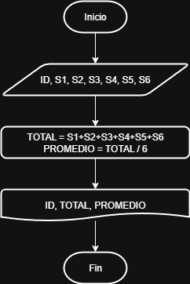
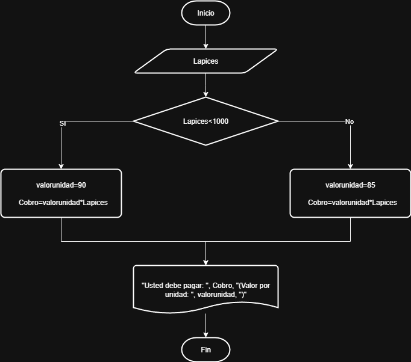

# _Pseudocódigo_

# Símbolos Comunes de Diagramas de Flujo

Los diagramas de flujo utilizan una variedad de símbolos para representar procesos, decisiones, entradas/salidas y conexiones. A continuación se describen los más comunes:

## 🟦 Símbolo de Proceso
- También conocido como **símbolo de acción**
- Representa una acción, función o proceso dentro del flujo
- Es el símbolo más utilizado

## 🟩 Símbolo de Inicio y Fin
- También llamado **símbolo terminador**
- Indica el punto de inicio o fin del proceso
- Suele contener las palabras "Inicio" o "Fin"

## 📄 Símbolo de Documento
- Representa la entrada o salida de un documento
- Ejemplos de entrada: recibir un informe, correo electrónico, pedido
- Ejemplos de salida: generar una presentación, memo o carta

## 🔀 Símbolo de Decisión
- Representa una pregunta que debe responderse (sí/no, verdadero/falso)
- El flujo se divide en ramas según la respuesta

## 🔗 Símbolo de Conector
- Se usa en diagramas complejos para conectar elementos separados en una página

## 📘 Símbolo de Conector Fuera de Página
- Conecta elementos en múltiples páginas
- Incluye número de página para referencia

## 📥 Símbolo de Entrada/Salida
- También llamado **símbolo de datos**
- Representa datos disponibles como entrada o salida
- Indica recursos utilizados o generados

## 📝 Símbolo de Comentario o Nota
- Agrega explicaciones o comentarios dentro del diagrama
- Puede conectarse mediante línea discontinua al área correspondiente

---

Fuente: [Lucidchart - Simbología de diagramas de flujo](https://www.lucidchart.com/pages/es/simbolos-comunes-de-los-diagramas-de-flujo)

 

# _Ejercicios_

### 1. Analicemos el siguiente problema y representemos su solución mediante un algoritmo secuencial.

- Construye un algoritmo que, al recibir como datos **el ID** del empleado y los seis primeros sueldos del año, calcule el ingreso total semestral y el promedio mensual, e imprima el ID del empleado, el ingreso total y el promedio mensual.

#### Pseudocódigo:

```
Inicio 
leer ID, S1, S2, S3, S4, S5, S6
TOTAL = S1+S2+S3+S4+S5+S6
PROMEDIO = TOTAL / 6
Escribir ID, TOTAL, PROMEDIO
Fin
``` 


### 2. 

## Condiciones

### 3. Realice un algoritmo para determinar cuánto se debe pagar por equis cantidad de lápices considerando que si son 1000 o más el costo es de $85 cada uno; de lo contrario, el precio es de $90. Represéntelo con el pseudocódigo y el diagrama de flujo.

|Variables|Tipo|
|---------|----|
|Lapices|Entrada|
|Precio|Salida|
|valorunidad|salida|
|85 / 90 / 1000|Constantes|

#### Pseudocódigo

```
Inicio
Leer Lapices
si Lapices<1000:
  valorunidad=90
  Cobro=valorunidad*Lapices
  si no:
  valorunidad=85
  Cobro=valorunidad*Lapices
Fin Si
Imprimir "Usted debe pagar: ", Cobro, "(Valor por unidad: ", valorunidad, ")"
Fin   
```
 

### 4. Un almacén de ropa tiene una promoción: por compras superiores a $250 000 se les aplicará un descuento de 15%, de caso contrario, sólo se aplicará un 8% de descuento. Realice un algoritmo para determinar el precio final que debe pagar una persona por comprar en dicho almacén y de cuánto es el descuento que obtendrá. Represéntelo mediante el pseudocódigo y el diagrama de flujo.

#### Análisis

|Variables|Tipo|Comentario|
|---------|----|----------|
|totalcompra|entrada|Valor bruto de la compra|
|preciofinal|salida|precio a pagar con el descuento aplicado|
|descuento|salida|el descuento que se hace dependiendo del total de la compra|
|15% / 8% / $250000 |constantes|descuentos que se pueden aplicar, valor de referencia|

#### Pseudocódigo

```
Inicio
Leer totalcompra
Si totalcompra<250000:
  descuento=totalcompra*0.15
  si no:
  descuento=totalcompra*0.08
Fin Si 
preciofinal=totalcompra-descuento
Escribir "Valor a pagar: ", preciofinal, ". se hizo un descuento de ", descuento 
Fin
```
### 5. El director de una escuela está organizando un viaje de estudios, y requiere determinar cuánto debe cobrar a cada alumno y cuánto debe pagar a la compañía de viajes por el servicio. La forma de cobrar es la siguiente: si son 100 alumnos o más, el costo por cada alumno es de $65.00; de 50 a 99 alumnos, el costo es de $70.00, de 30 a 49, de $95.00, y si son menos de 30, el costo de la renta del autobús es de $4000.00, sin importar el número de alumnos.

#### Análisis

|Variables|Tipo|Comentario|
|---------|----|----------|
|x|entrada|cantidad de alumnos|
|costoalumno|salida|valor a cobrar por alumnos|
|costototal|salida|costo de los alumnos mas autobus|
|(x>=100) / (50<=x<100) / (30<=x<50) / (x<300) |constantes|rangos de alumnos|
|$65 / $70 / $95 / $4000|constantes|precios por cantidad de alumnos|

#### Pseudocódigo

```
Inicio
Leer x
Si x>=100:
  costoalumno=65
  costotoal=costoalumno*x
  si no:
  Si x>=50:
    costoalumno=70
    costotoal=costoalumno*x
    si no:
    Si x>=30:
      costoalumno=95
      costotoal=costoalumno*x
      si no:
      costotoal=4000 
      costoalumno=costotal/x
    Fin si
  Fin si
Fin si
Imprimir costoalumno, costototal
Fin
```

## _Tarea_

Crear un pseudocódigo y un diagrama de flujo para el siguiente proceso:
Ingresar día, mes y año de nacimiento (son variables de entrada). Ingresar día, mes y año actual, es decir, la fecha actual (son variables de entrada). 
Calcular edad (variable de salida).

### Pseudocódigo.

```
Inicio
Leer DíaN, MesN, AñoN, DíaA, MesA, AñoA
Edad = AñoA - AñoN
Si MesA < MesN:
  Edad = Edad -1
  Si no
  Si (MesA = MesN) ∧ (DiaA < DiaN):
    Edad = Edad -1 
  Fin Si
Fin Si
Escribir "Tu edad es de: ", Edad, " años"
Fin
```
## Bucles o ciclos

### 1. Se requiere un algoritmo para obtener la suma de diez cantidades, que se leen del teclado, mediante la utilización de un ciclo while. Realice el diagrama de flujo y el pseudocódigo.

#### Pseudocódigo

```
Inicio
suma = 0
i = 0
Mientras i<10
  Leer cantidad
  suma = suma + cantidad
  i = i + 1
FinMientras
Escribir suma
Fin  
```

### 2. Se requiere un algoritmo para obtener la suma de diez cantidades mediante la utilización de un ciclo for. Realice el diagrama de flujo y el pseudocódigo.

#### Pseudocódigo

```
Inicio
Suma = 0
Para i = 1 hasta i = 10
  Leer cantidad
  suma = suma + cantidad
FinPara
Escribir suma
Fin  
```

### 3. Se requiere un algoritmo para determinar, de N cantidades, cuántas son cero, cuántas son menores a cero, y cuántas son mayores a cero.

```
Inicio
menores = 0
ceros = 0
mayores = 0
Leer N
Para i = 0 hasta i = N
  Leer cant
  Si cant < 0 :
    menores = menores + 1
    si no:
    Si cant = 0 :
      ceros = ceros + 1
      si no:
      mayores = mayores + 1
    FinSi
  FiSi
  i = i + 1
FinPara 
Imprimir menores,  ceros, mayores
Fin
```

### 4. Calcular el Factorial de un número entero ingresado por el usuario.

#### Pseudocódigo

```
Inicio
Leer N
factorial = 1
Mientras N > 1
  factorial = factorial * N
  N = N - 1
FinMientras
Escribir factorial
Fin
```